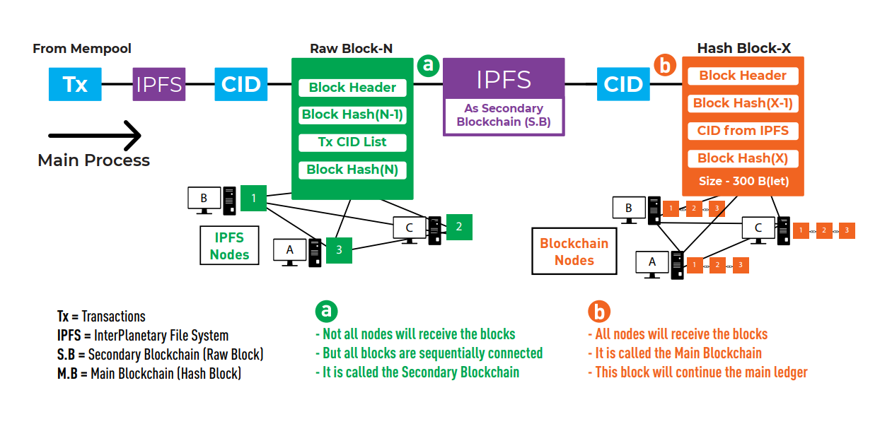

# Scalabale blockchain system
A public blockchain system that performs better than Bitcoin in terms of throughput 
and storage requirements. Although this system is primarily based on 
cryptocurrencies, it may also be applied to other domains such as healthcare, 
supply chain management, etc. by making a few modifications to the verification process.


## Description

For many years, numerous cryptocurrencies have been supported by the 
innovative technology known as blockchain. This decentralized system, 
despite having many unique characteristics, falls behind centralized 
currency systems in terms of scalability and cannot be adopted by other 
platforms. Increasing throughput and reducing the dependence on huge storage 
are the goals of this project.

System describe


Transaction verification process describe

## Getting Started

### Dependencies

* base58==2.0.1
* certifi==2020.12.5
* cffi==1.14.4
* chardet==3.0.4
* cryptography==3.3.1
* ecdsa==0.16.1
* idna==2.10
* ipfshttpclient==0.6.1
* jsonpickle==1.4.2
* llvmlite==0.36.0
* multiaddr==0.0.9
* netaddr==0.8.0
* numba==0.53.1
* numpy==1.20.3
* p2pnetwork==1.0
* Pillow==8.2.0
* pycoin==0.80
* pycparser==2.20
* pytesseract==0.3.7
* requests==2.25.0
* six==1.15.0
* starkbank==2.2.2
* starkbank-ecdsa==1.0.0
* tinyec==0.3.1
* urllib3==1.26.2
* varint==1.0.2
* IPFS

### Installing

* Either fork or download the project 
* It is recommended to open this project in pycharm
* Install all the dependencies (How to do it?)
* Install ipfs (how to do it? give a link)
* Open cmd or terminal and run the following command to initiate ipfs daemon
* ``` ipfs daemon ```
* Forward a port in router (how to do it? give a link)
* Put your local ip and port number that you forwarded in my_own_p2p_application_json.py (Show where with ss)

### Executing program
There are two parts of this program. One is the User End where a user either generates 
a transaction and sends it to the validators or creates a new address and key pairs for receiving
asset. And the other part is the Miner End where the miner validates the transaction that 
the user sent and adds this transaction to the blockchain after validation.
* For both ends at first run the server.py to start the web server. (How to do it?)
* A web interface will be hosted at http://localhost:5000
* Go to http://localhost:5000 in your browser (preferably Google Chrome) and use the 
web interface according to the need (Either use User End to generate transaction/ receiver address or use 
Miner End to validate the transactions)


[comment]: <> (* How to run the program)

[comment]: <> (* Step-by-step bullets)

[comment]: <> (```)

[comment]: <> (code blocks for commands)

[comment]: <> (```)
#### User End
  * By going to http://localhost:5000 address in the browser a home page will be found.
  * Click the user end button to go to the user end page.
  * There are two options: one is to generate a new address for receiving new assets and the other is to create
a transaction.
  * To create a new address
    * Click the create address button in the user end page to generate a new public-private key pair and an address.
    * Store these information locally.
  * To create a transaction
    * Click the generate transaction button in the user end page to go to the transaction generation page
    * Put sender address, receiver address, amount, block number, sender's public key and private key to the form
    and hit generate transaction button.
    * The next page is for review the generated transaction.
    * Press the send button to send this transaction to the miners in the network.


[comment]: <> (  ```)

[comment]: <> (  code blocks for commands)

[comment]: <> (    ```)
#### Miner End
  * By going to http://localhost:5000 address in the browser a home page will be found.
  * Click the miner end button to go to the miner end page.
  * In the miner end page there is a button to start the mining process.
  * After clicking the button the system will start to verify transactions and generate raw block and hash block.
  * And will add these blocks to the corresponding blockchains and will broadcast the hash block among other miners.

[comment]: <> (  * )

[comment]: <> (  * Step-by-step bullets)

[comment]: <> (    ```)

[comment]: <> (    code blocks for commands)

[comment]: <> (    ```)
## Help

Any advise for common problems or issues.
```
command to run if program contains helper info
```

## Authors

Minhaz Mamud  
[@linkedin](https://www.linkedin.com/in/minhaz18)  
[@gmail](mailto:minhaz18061997@gmail.com)

## Version History

* 0.1
    * Initial Release
    * See [commit change]() or See [release history]()


## License

This project is licensed under the [NAME HERE] License - see the LICENSE.md file for details

## Acknowledgments

Inspiration, code snippets, etc.
* [awesome-readme](https://github.com/matiassingers/awesome-readme)
* [PurpleBooth](https://gist.github.com/PurpleBooth/109311bb0361f32d87a2)
* [dbader](https://github.com/dbader/readme-template)
* [zenorocha](https://gist.github.com/zenorocha/4526327)
* [fvcproductions](https://gist.github.com/fvcproductions/1bfc2d4aecb01a834b46)