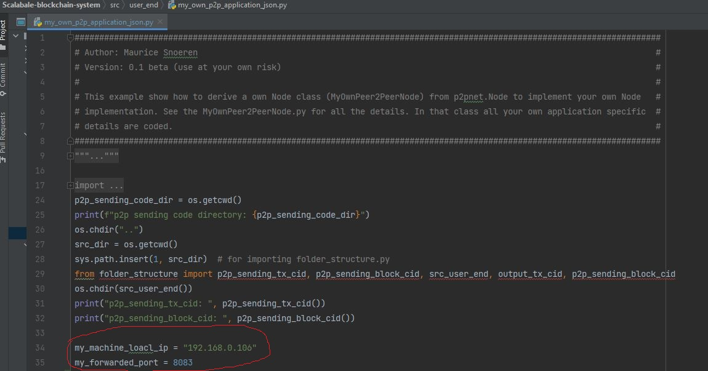

# Scalabale blockchain system
A public blockchain system that performs better than Bitcoin in terms of throughput 
and storage requirements. Although this system is primarily based on 
cryptocurrencies, it may also be applied to other domains such as healthcare, 
supply chain management, etc. by making a few modifications to the verification process.


## Description

For many years, numerous cryptocurrencies have been supported by the 
innovative technology known as blockchain. This decentralized system, 
despite having many unique characteristics, falls behind centralized 
currency systems in terms of scalability and cannot be adopted by other 
platforms. Increasing throughput and reducing the dependence on huge storage 
are the goals of this project.

### System overview
The proposed system has two parts: one is User End and the other is Miner End. The User End is
used to generate transaction and the Miner End is used to validate that transaction.
#### User End
##### Transaction Generation Process

* At first the user/sender generates a message with the sending info (Sender address, Block number
from where the sender gets his/her's asset), receiver info (Receiver address, Amount to be
sent) and public key.
* Following that the user generates a digital signature using his/her private key and message.
* Finally, the raw/original transaction is ready after adding the digital signature with the message. 
##### Transaction Sending Process

* After generating the raw transaction the user sends this transaction to the IPFS (InterPlanetary File System),
a distributed system that has a feature of file storing.
* IPFS returns a CID (Content Identifier) for the raw transaction. With this CID anybody can 
fetch the raw transaction from IPFS. (N.B. If the content of transaction changes the corresponding
CID also changes. So, the transaction can not be tempered or modified in IPFS.)
* The user then sends this CID of his/her transaction to the miners through a peer to peer (p2p)
network.

#### Miner End
##### Miner End Process Overview

* At first the miner receives the transaction CID from the miner through p2p and fetches the 
original/ raw transaction from IPFS.
* After that, the transaction goes through a verification process that has multiple checks such as double-spending
check, balance check and authentication check.
* ##### (Transaction verification process describe) will be added soon
* If the transaction passes all the checks the CID of the corresponding transaction is added to the mempool
otherwise the transaction is discarded.
* After a certain number of transactions are verified (determined by miner), the block generation process starts.
* In the block generation process, at first a raw block is generated with the transaction CIDs using
POW (proof of work) consensus.
* Then the raw block is added to the IPFS and again IPFS returns a CID for the corresponding block.
  (N.B. This raw block is not distributed among miners unlike bitcoin.)
* With the CID of the raw block the miner again generates a block named Hash block using the same consensus, POW.
* Finally, this hash block is broadcasted among other miners through p2p. All the miners in the 
network stores this block locally after verifying the block is valid.

### Achievements
#### Increasing Throughput
As the raw block is not shared among the miners and not stored locally, the size of this 
block is up to the miner.  This block can accommodate a numerous number of transactions without worrying 
about the network's bandwidth, latency, or dependence on local storage. Additionally, since 
the CID is uniform in size and less than the original/raw transaction, more 
transaction CIDs can be added to the raw block. Throughput can be raised in this manner.

#### Reducing Latency and Storage Dependency
The size of the hash block is very small and constant which is around 300 Bytes. 
By distributing this small sized block to the network, the latency can be reduced. 
The storage dependency also reduces significantly, as all the miners store the hash 
block locally instead of raw block.


## Getting Started

### Dependencies

* base58==2.0.1
* certifi==2020.12.5
* cffi==1.14.4
* chardet==3.0.4
* cryptography==3.3.1
* ecdsa==0.16.1
* idna==2.10
* ipfshttpclient==0.6.1
* jsonpickle==1.4.2
* llvmlite==0.36.0
* multiaddr==0.0.9
* netaddr==0.8.0
* numba==0.53.1
* numpy==1.20.3
* p2pnetwork==1.0
* Pillow==8.2.0
* pycoin==0.80
* pycparser==2.20
* pytesseract==0.3.7
* requests==2.25.0
* six==1.15.0
* starkbank==2.2.2
* starkbank-ecdsa==1.0.0
* tinyec==0.3.1
* urllib3==1.26.2
* varint==1.0.2
* IPFS

### Installing

* Either fork or download the project 
* It is recommended to open this project in pycharm
* Install all the dependencies (How to do it?)
* Install ipfs using the [link](https://docs.ipfs.tech/install/).
* Open cmd or terminal and run the following command to initiate ipfs daemon
* ``` ipfs daemon ```
* Forward a port in router. Can take help from
[link](https://www.noip.com/support/knowledgebase/general-port-forwarding-guide/) or [link](https://www.youtube.com/watch?v=2G1ueMDgwxw).
* Change two variables (my_machine_local_ip = your local ip and my_forwarded_port = your port number
that you forwarded in previous step) in my_own_p2p_application_json.py file. 



### Executing program
There are two parts of this program. One is the User End where a user either generates 
a transaction and sends it to the validators or creates a new address and key pairs for receiving
asset. And the other part is the Miner End where the miner validates the transaction that 
the user sent and adds this transaction to the blockchain after validation.
* For both ends at first start the web server by following either one step.
  * Open pycharm or Vscode and run server.py
  * Open terminal or cmd and go to the "project directory / web" and run server.py with python interpreter.
* A web interface will be hosted at http://localhost:5000.
* Go to http://localhost:5000 in your browser (preferably Google Chrome) and use the 
web interface according to the need (Either use User End to generate transaction/ receiver address or use 
Miner End to validate the transactions)


[comment]: <> (* How to run the program)

[comment]: <> (* Step-by-step bullets)

[comment]: <> (```)

[comment]: <> (code blocks for commands)

[comment]: <> (```)
#### User End
  * By going to http://localhost:5000 address in the browser a home page will be found.
  * Click the user end button to go to the user end page.
  * There are two options: one is to generate a new address for receiving new assets and the other is to create
a transaction.
  * To create a new address
    * Click the create address button in the user end page to generate a new public-private key pair and an address.
    * Store these information locally.
  * To create a transaction
    * Click the generate transaction button in the user end page to go to the transaction generation page
    * Put sender address, receiver address, amount, block number, sender's public key and private key to the form
    and hit generate transaction button.
    * The next page is for review the generated transaction.
    * Press the send button to send this transaction to the miners in the network.


[comment]: <> (  ```)

[comment]: <> (  code blocks for commands)

[comment]: <> (    ```)
#### Miner End
  * By going to http://localhost:5000 address in the browser a home page will be found.
  * Click the miner end button to go to the miner end page.
  * In the miner end page there is a button to start the mining process.
  * After clicking the button the system will start to verify transactions and generate raw block and hash block.
  * And will add these blocks to the corresponding blockchains and will broadcast the hash block among other miners.

[comment]: <> (  * )

[comment]: <> (  * Step-by-step bullets)

[comment]: <> (    ```)

[comment]: <> (    code blocks for commands)

[comment]: <> (    ```)

[comment]: <> (## Help)

[comment]: <> (Any advise for common problems or issues.)

[comment]: <> (```)

[comment]: <> (command to run if program contains helper info)

[comment]: <> (```)

## Authors

#### Minhaz Mahmud [@linkedin](https://www.linkedin.com/in/minhaz18) [@gmail](mailto:minhaz18061997@gmail.com)

#### Md. Soharab Hossain Sohan

#### Faisal Alam Opu

## Version History

* 0.1
    * Initial Release
    * See [commit change]() or See [release history]()


## License

This project is licensed under the MIT License - see the [LICENSE.md](LICENSE.md) file for details

## Acknowledgments

[comment]: <> (Inspiration, code snippets, etc.)
* [awesome-readme](https://github.com/matiassingers/awesome-readme)

[comment]: <> (* [PurpleBooth]&#40;https://gist.github.com/PurpleBooth/109311bb0361f32d87a2&#41;)

[comment]: <> (* [dbader]&#40;https://github.com/dbader/readme-template&#41;)

[comment]: <> (* [zenorocha]&#40;https://gist.github.com/zenorocha/4526327&#41;)

[comment]: <> (* [fvcproductions]&#40;https://gist.github.com/fvcproductions/1bfc2d4aecb01a834b46&#41;)